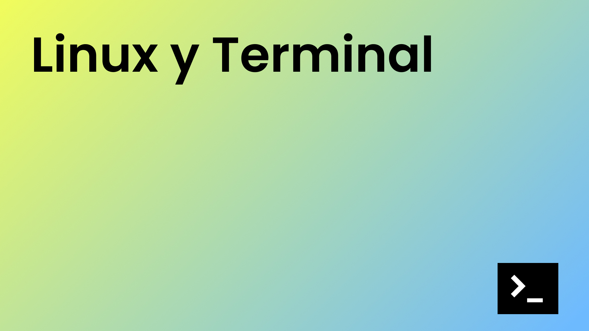

<h1>Máster en Desarrollo FullStack</h1>

<h2>Repositorio creado para el módulo de Línux y la Terminal para Máster de Desarrollo FullStack</h2>

<h4>Material de las clases</h4>
<ul>
    <li><a target="_blank" href="https://github.com/ConquerBlocks/conquerblocks-linux-terminal/blob/master/01_clases/LyT%20Clase%2001%20-%20Qu%C3%A9%20es%20Linux%20y%20la%20Terminal.pdf">LyT Clase 01 - Qué es Linux y la Terminal</a></li>
    <li><a target="_blank" href="https://github.com/ConquerBlocks/conquerblocks-linux-terminal/blob/master/01_clases/LyT%20Clase%2002%20-%20Instalaci%C3%B3n%20y%20secciones%20de%20Virtual%20Box.pdf">LyT Clase 02 - Instalación y secciones de Virtual Box</a></li>
    <li><a target="_blank" href="https://github.com/ConquerBlocks/conquerblocks-linux-terminal/blob/master/01_clases/LyT%20Clase%2003%20-%20Instalando%20Sistemas%20Operativos%20Windows%20y%20Linux%20Multiboot.pdf">LyT Clase 03 - Instalando Sistemas Operativos Windows y Linux Multiboot</a></li>
    <li><a target="_blank" href="https://github.com/ConquerBlocks/conquerblocks-linux-terminal/blob/master/01_clases/LyT%20Clase%2004%20-%20Instalaci%C3%B3n%20%C3%BAnicamente%20de%20Linux%20o%20Windows%2010.pdf">LyT Clase 04 - Instalación únicamente de Linux o Windows 10</a></li>
    <li><a target="_blank" href="https://github.com/ConquerBlocks/conquerblocks-linux-terminal/blob/master/01_clases/LyT%20Clase%2005%20-%20Instalaci%C3%B3n%20guest%20additions%20en%20Virtual%20Box.pdf">LyT Clase 05 - Instalación guest additions en Virtual Box</a></li>
    <li><a target="_blank" href="https://github.com/ConquerBlocks/conquerblocks-linux-terminal/blob/master/01_clases/LyT%20Clase%2006%20-%20WSL%20Windows%20Subsystem%20for%20Linux.pdf">LyT Clase 06 - WSL Windows Subsystem for Linux</a></li>
    <li><a target="_blank" href="https://github.com/ConquerBlocks/conquerblocks-linux-terminal/blob/master/01_clases/LyT%20Clase%2007%20-%20Archivos%20%C3%BAtiles%20y%20primeros%20comandos.pdf">LyT Clase 07 - Archivos útiles y primeros comandos</a></li>
    <li><a target="_blank" href="https://github.com/ConquerBlocks/conquerblocks-linux-terminal/blob/master/01_clases/LyT%20Clase%2008%20-%20%20Ficheros%20y%20ficheros%20de%20configuraci%C3%B3n.pdf">LyT Clase 08 -  Ficheros y ficheros de configuración</a></li>
    <li><a target="_blank" href="https://github.com/ConquerBlocks/conquerblocks-linux-terminal/blob/master/01_clases/LyT%20Clase%2009%20-%20Directorios%20especiales%2C%20rutas%20y%20comodines.pdf">LyT Clase 09 - Directorios especiales, rutas y comodines.pdf</a></li>
</ul>
